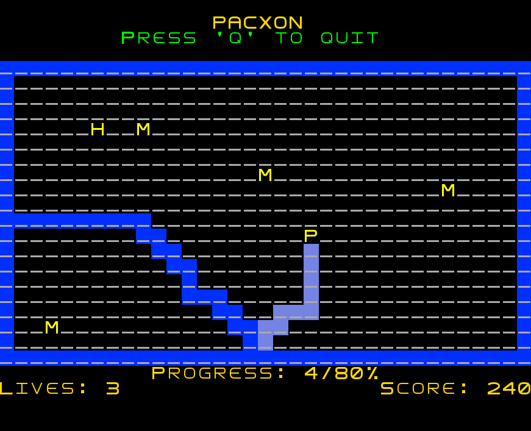

# PacXon - LDTS 2023/2024

## Group 10 elements

| Name            | Number    | E-Mail            |
|-----------------|-----------|-------------------|
| Bruno Machado   | 201907715 | up201907715@up.pt |
| José Felisberto | 202108657 | up202108657@up.pt |
| Miguel Sousa    | 202207986 | up202207986@up.pt |

## Description

PacXon is an arcade game based on the classic Pacman in which the goal is to fill the arena with blocks. In each level, the goal is to
fill the majority of the arena, while avoiding crossing paths with the monsters. PacXon can conquer little portions of the arena iteratively
and wins as soon as the area conquered is equal or bigger than 80%.

For more detailed information about PacXon, please check the [Game Description](./docs/README.md).

## Game Shots

The following screenshots illustrate the general look of our game, as well as the divergent functionalities:

  

  <b><i>Fig 1. Main Menu </i></b>

  

  <b><i>Fig 2. Rules Menu </i></b>

  

  <b><i>Fig 3. PacXon gameplay</i></b>

  

  <b><i>Fig 4. Win Menu </i></b>

  

  <b><i>Fig 5. Game Over Menu </i></b>

