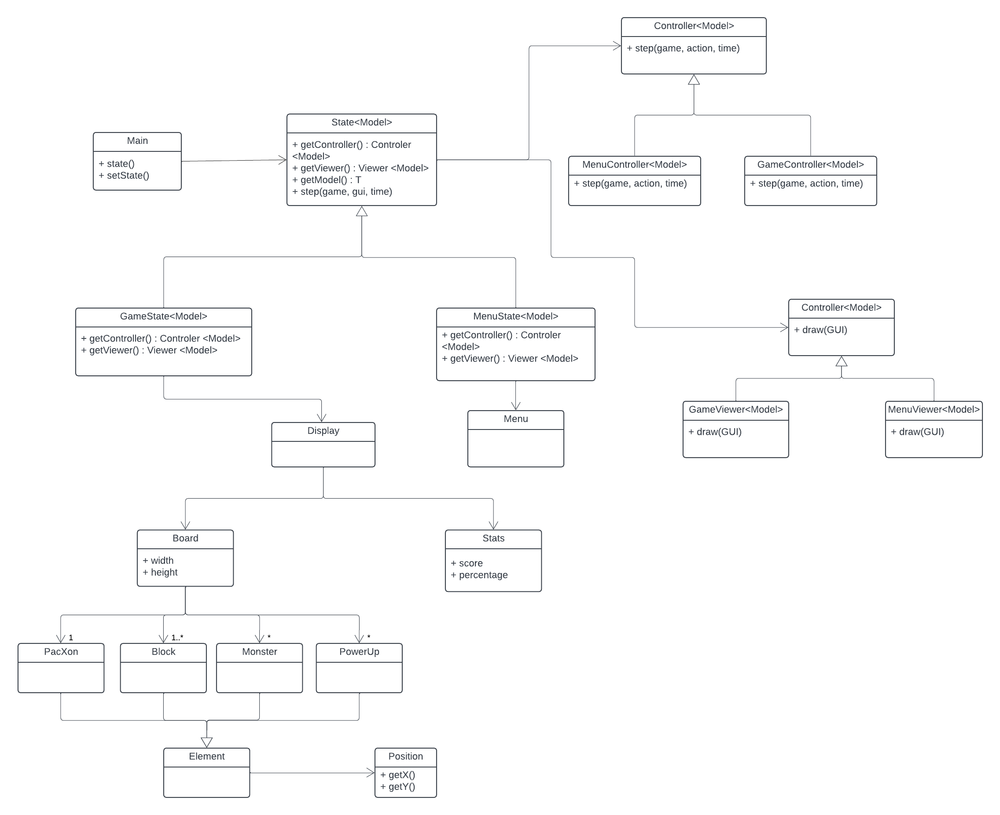
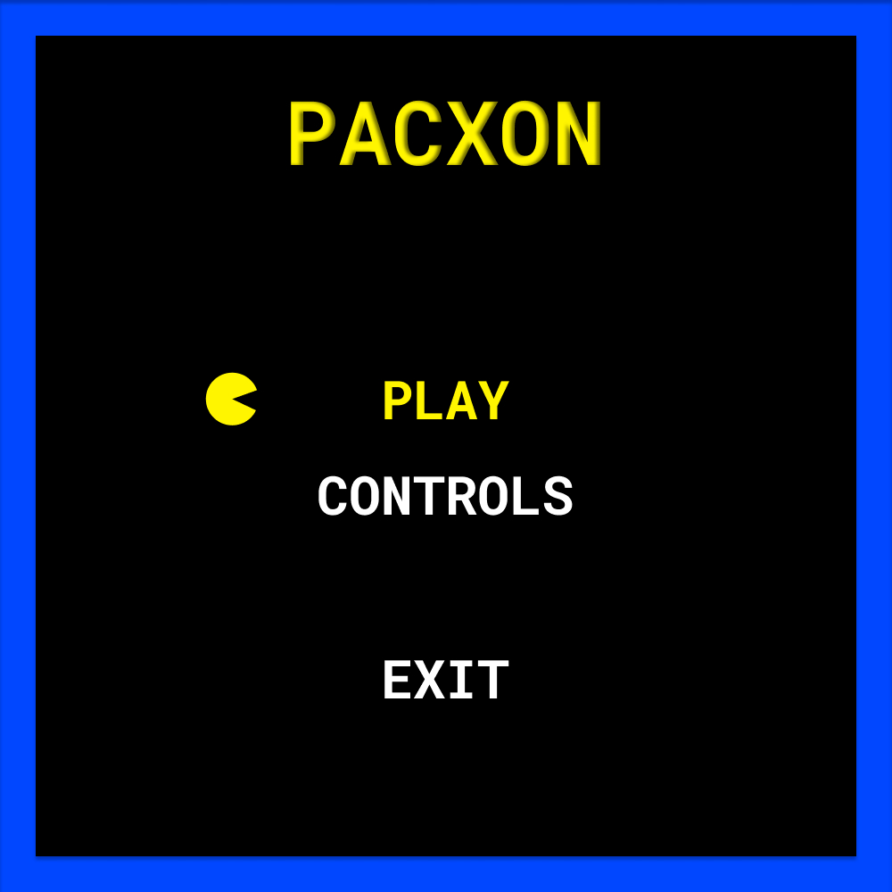
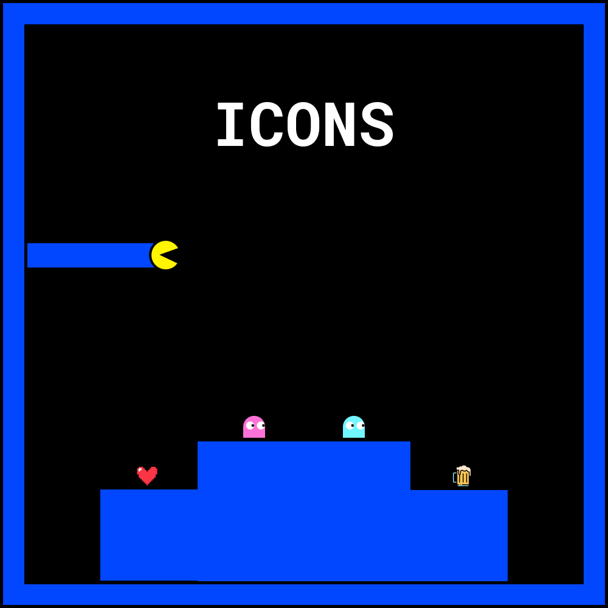
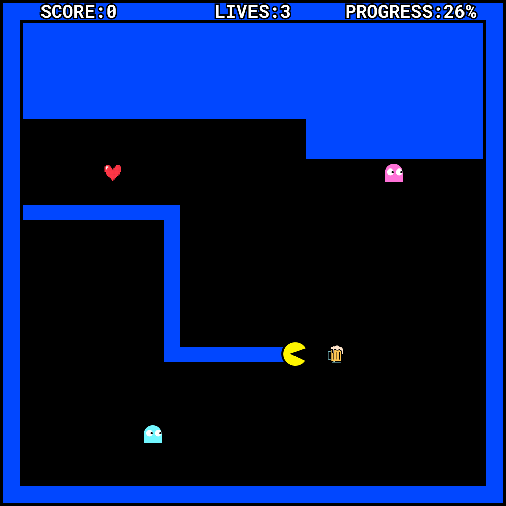
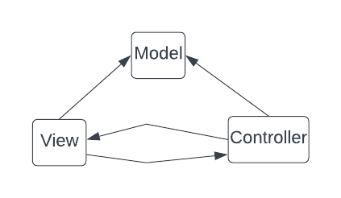
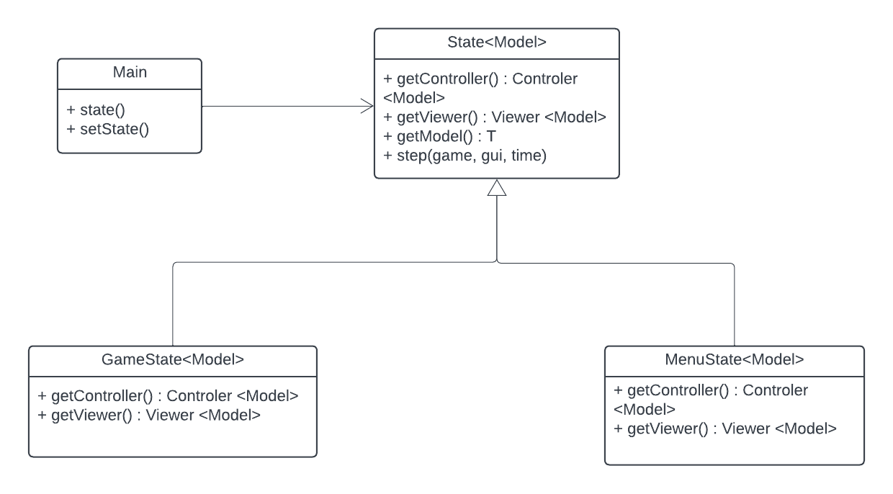
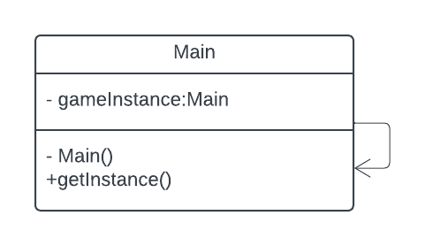

# PacXon

## Description

PacXon is a arcade game based on the classic Pacman in which the goal is to fill the arena with blocs. In each level, the goal is to 
fill the majority of the arena, while avoiding to cross paths with the monsters. PacXon can conquer little portions of the arena iteratively
and wins as soon as the area conquered is equal or bigger than 80%.

## Key Features

- **Main Menu**: As soon as the game is open, the main menu is displayed, giving the user 3 options to choose from: _play_, _rules_ and _exit_. 

- **Initial State**: The game starts with a rectangular arena, with all the borders already filled with space "conquered" by the hero.
The hero starts with 3 lives and, obviously, the score and the progress(%) start at 0. 

- **Game Elements**:
    - PacXon - the element that the user controls. Can move up, down, left or right, unless it moves against the borders of the arena. Starts with
3 lives, and loses 1 if it collides with a monster.
    - Monster - computer-controlled elements that chase the PacXon trying to avoid its progress. Have the same move privilleges as PacXon.
    - Blocks - square-shaped area unit that defines user progress. Every PacXon move increments the current path by one.
    - Power Ups - influence the game state depending on which of them has been catched. 

- **Gameplay**:
  - For each square of the arena conquered by the hero, the score goes up 10 points, and the percentage of the arena filled goes up in the progress stat. To do that the hero must start and finish in the parts of the arena that are already conquered, while avoiding to collide directly with the monsters, and also avoiding for the monsters to collide with the path that the hero is tracing.
  - There are two types of power ups, the beer and the heart. In the case of the beer, if it is catched by the hero, all the enemies stop in their positions 5 seconds, in the case of the heart, the hero gains one life. 
  - There are two types of outcome in the game, or the user can fill at least 80% of the map, ad goes through to the next level, or the hero loses all the lives and have to start from the beginning, by going back all the way to level 1. Each level will go up in difficulty, the enemies ,will go up in number, and also the speed of them will also increase.

## UML Class Diagram

## Mockups

## Design

1. 
**Problem in context.**
The most central question we faced at the start of the developing of this project was to choose the way we would have to structure the game, i.e., how to divide and connect each part of the game development.

**The pattern.**
To overcome this problem, we chose the Model-View-Control Architectural Pattern, a very common pattern in GUI application development that aims to sort the functions used in the program by its role in the context.
Ultimately, to structure the codebase of an application.

**Implementation.**
Its intent is to separate the development process between 3 components:
- Model: represent and manage game logic, assuring the correct execution of it, not caring how to graphically display the game elements.
- View: represent the user interface, being responsible for the graphical representation of the game elements and placing them into the arena. It also sends user actions to the Controller.
- Controller: even though this part is not going to feature in this phase of delivery, it will be responsible for the exchanges of information between the Model and the View layer
  Manages input from the user and sends update signals to those two layers, to change the internal state and the corresponding graphical display.

**Consequences:** more organized developing process, making it faster to correct/add code for a known matter. Increases scalability tolerance.

  

2.
**Problem in context.**
We identified 2 distinct phases of the game, and had to find a way to choose which phase the game was currently in, as it could not be in both simultaneously.

**The pattern.**
To overcome this problem, we chose the State Pattern, allowing objects to alter their behaviour regarding the internal state of the game (it's a behavioral design pattern).
In our case, it will be particularly crucial as we will have to differ the behaviour of our display, given if it is in the main menu or in the playing phase itself.

**Implementation.**
The State Pattern enables us to distinguish the representation and behaviour of the main menu (MenuState) and the proper game (GameState), overriding the functions that are responsible for the calls to the Controller and the Viewer
with different code, considering the internal current state.

**Consequences:** more organized developing process, making it faster to correct/add code for a known matter. Increases scalability tolerance.

  

3.
**Problem in context.**
One of the challenges in the development of this game is efficiently creating instances of various in-game entities, such as characters, power-ups, or obstacles. These entities might have different implementations based on game conditions or levels, making it essential to encapsulate their creation and ensure a flexible and maintainable design.

**The pattern.**
To overcome this problem, we chose the Factory Pattern, providing an interface for creating objects in a superclass but allows subclasses to alter the type of objects that will be created. This pattern addresses the problem of creating instances of classes without specifying their exact class types. It promotes loose coupling by delegating the responsibility of object instantiation to subclasses.

**Implementation.**
Its intent is to separate the development process between 7 phases:
- Make all products implement the same interface: define an interface that declares methods making sense for all products.
- Add an empty factory method within the creator class: add a factory method in the creator class with a return type matching the common product interface.
- Refactor constructor references to factory method calls: in the creator class code, replace all references to product constructors one by one with calls to the factory method. Extract the product creation code into the factory method. You may need to add a temporary parameter to the factory method to control the type of product returned.
- Handle potentially messy factory method code: the factory method code may initially look unattractive, with a large switch statement choosing which product class to instantiate. Don't worry; we'll address this soon.
- Create subclasses for each product type: create subclasses for each product type listed in the factory method. Override the factory method in the subclasses and extract the appropriate portions of the construction code from the base method.
- Consider reusing a control parameter in subclasses: if there are many product types and creating subclasses for all doesn't make sense, you can reuse a control parameter from the base class in the subclasses. For example, passing an argument to the factory method of the base class to control the desired product type.
- Handle empty base factory method: if, after all extractions, the base factory method is empty, make it abstract. If there's anything left, you can make it the default behavior of the method.

**Consequences:** The Factory Method pattern offers flexibility and loose coupling, enabling the seamless addition of new products without modifying existing code. It adheres to design principles like the Single Responsibility Principle and supports scalability, contributing to a maintainable and extensible codebase.

  

4.
**Problem in context.**
One of the fundamental challenges in game development is managing the flow of the game, especially in real-time games like Pac-Xon. The game needs to continuously check for player inputs, update the game state, and render the updated state to the screen. This continuous cycle is crucial for creating a dynamic and responsive gaming experience.

**The pattern.**
To address this, the Game Loop pattern is an ideal choice. It is a behavioral design pattern that continually runs during the game, updating game logic and rendering the game state at a consistent rate. This pattern is essential for keeping the game's progression smooth and responsive.

**Implementation:**
- Initialization Phase: Set up the initial game state, load resources, and initialize game entities.
- Start of the loop: The loop begins after initialization, continuously running until the game ends.
- Process Input: Gather and process player inpputs or other external events.
- Update Game State: Based on the inputs and existing game state, update game entities. This includes movement, collision detection, and game logic.
- Render: Draw the updated game state to the screen. This is where the game's visual representation is updated.
- Check Conditions: At the end of each loop, check for any conditions that might end the game, such as player lives, completion of objectives, or exit commands.

**Consequences:** The Game Loop pattern provides a structured way to handle real-time changes in the game. It ensures that the game responds promptly to user inputs and that the game state is consistently updated and rendered. This pattern is crucial for maintaining the fluidity and responsiveness of the game, making it an essential component of most interactive games.

5.
**Problem in Context**
In our game, there's a need for a centralized control and accessp point for the main game sate. This could include all the fundamental's to the game's operations and should be consistently accessible thoughout the game without creating multiple instances.

**The pattern**
The Singleton pattern ensures that only one instance of the class managing the main game state exists throughout the game's lifecycle.

**Implementation:**
- Private Constructor: Make the constructor of the class private to prevent instantiation from outside the class.
- Private Static Instance: Create a private static instane of the class itself within the class.
- Public Static Method: Provide a static method, i.e., getInstance(), that returns the instance of the game. Creates a new instance if on does not exist and returns the existing instance otherwise.

**Consequences**
This approach ensures controlled access to a single, global instance, crucial for consistent handling of shared resources like game settings. While Singleton's implementation is straightforward and allows for easy access from anywhere in the application, it also introduces a global state, which should be used carefully to avoid issues with maintainability and testing. This method ensures that critical game components are reliably and uniformly managed throughout the game's lifecycle.

  

